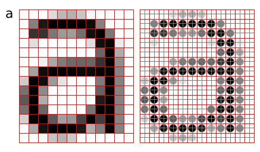

Title:Bilgisayar grafikleri
Date: 2014-05-03 18:00
### Piksel
Bir piksel bir kare ya da daire değil, sadece ufacık bir ışık. Bir alanı yok ama bir konumu ve değeri var.
<!---wavelength->renkler. subpixel->RGB,VRGB etc.-->

: Kaynak: [^pippin]

[^pippin]: http://pippin.gimp.org/image_processing/chap_dir.html

Evrendeki çoğu şey sürekli -en azından görünürde- fakat bilgisayar ekranı kesikli. Sürekli bir fonksiyonun kesikliye eşlenmesine _sampling_, sürekli bir değişkenin eşlenmesine _quantization_ deniliyor. İdeal bir resim ışık şiddetlerinin devamlı bir fonksiyonudur (x,y) ancak bu şekilde gösterilemez. Bir kafes üstündeki noktasal ışıklara eşleştirilir.

### Basamaklanma
Örnekleme(sampling) ve yeniden oluşturma(reconstruction) sırasında örnekleme yoğunluğu yeterli değilse basamaklanma(aliasing) meydana gelir.

